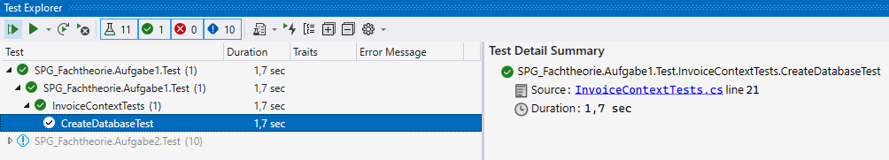
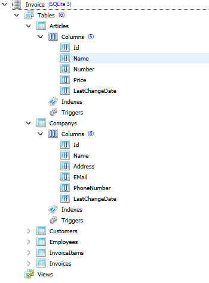
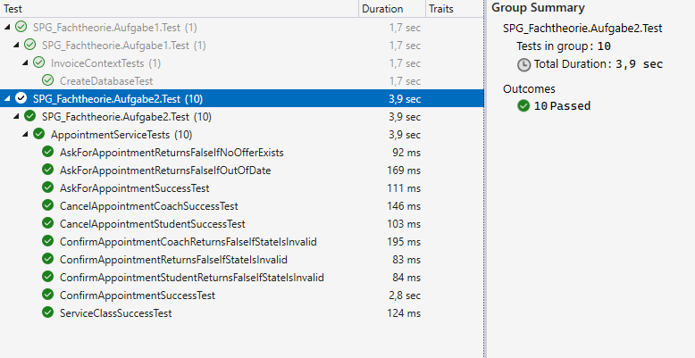

# Vorbereitung für die Matura in C#
## Angabe und Vorlage
https://github.com/schletz/Pos5xhif

https://github.com/schletz/Pos5xhif/tree/master/Matura/Angabe_Kolleg_Jan2022

## Aufgabe 1
### Tests

### DB

## Aufgabe 2
### Tests
